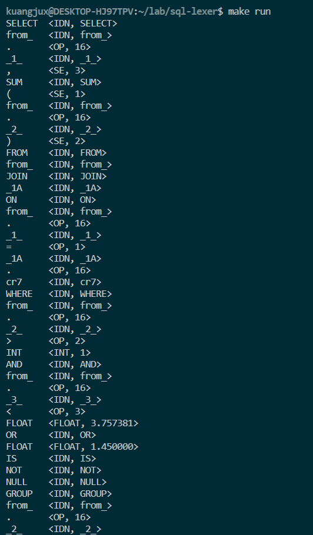

# 词法分析

## 实验内容
完成 SQL 语言的词法分析器，要求采用课程教授方法，实现有限状态机确定化，最小化算法。词法分析器的输入为 SQL 语言源代码，输出识别出单词的二元属性，填写符号表。单词符号的类型包括关键字、标识符、界符、运算符、整数、浮点数、字符串。

## 实验过程
在词法分析的实现中我们分别实现了两套机制：手工构造词法分析以及基于 NFA 转 DFA 的确定化以及 DFA 最小化算法，下面我将详细这两种实现方式。

### 手工构造词法分析  
```
                   +-------+                      +--------+
-- source code --> | lexer | --> token stream --> | parser | --> assembly
                   +-------+                      +--------+
```
  
在词法分析中，我们需要输入源代码，进而转化为 token stream。由于采用手工构造词法分析器，因此我们实现了 `next()` 方法来对一串源代码进行识别，并输出当前识别的 token，并将指针移到下一个 token 上，关于 `next()` 的框架如下所示：
  
```cpp
// 获取下一个 token
bool Lexer::next(bool show) {
    char* last_pos;
    while((token = *src) && *src != 0) {
        ...
    }
}
``` 
  
在主函数时，我们就可以不断循环调用 `next()` 函数从而不断获取 token。  
  
在进行识别 token 之前，我们首先需要规定 token 的类型，token 类型的定义如下所示：
```cpp
enum TokenType {
    Int, Float, // 整数, 浮点数
    Idn, // 标识符
    Str, // 字符串
    Equal, NonEqual, Less, LessEqual, Great, GreatEqual, SafeEqual, // 比较运算符
    And, And2, Or, Or2, Xor, Not, Not2,// 逻辑运算符(AND, &&, OR, || , XOR)
    Sub, // 算术运算符
    Dot, // 属性运算符
    Lp, Rp, Comma, // 界符((, ), ,)
    // 关键字
    Select, From, Where, As, WildCard,// 查询表达式
    Insert, Into, Values, Value, Default, // 插入表达式
    Update, Set,  // 更新表达式
    Delete, // 删除表达式
    Join, Left, Right, On, // 连接操作
    Min, Max, Avg, Sum, // 聚合操作
    Union, All, // 集合操作
    GroupBy, Having, Distinct, OrderBy, // 组操作 
    True, False, Unknown, Is, Null, // 条件语句
    Invalid // 无效的 token
};
```   
关于 token 的值的表示如下所示：
```cpp
struct TokenValue {
    double value; // token value, for Num
    // used when return a string or a symbol address for assignment
    Symbol* sym_ptr;
    char* str_ptr;
};
```  
  
其中关键字的定义如下，关于关键字如何识别我们将在下文提到：
```cpp
const TokenType keywords[] = {
    TokenType::Select,
    TokenType::From,
    TokenType::Where,
    TokenType::As, 
    TokenType::Insert,
    TokenType::Into, 
    TokenType::Values,
    TokenType::Value,
    TokenType::Default,
    TokenType::Update,
    TokenType::Set,
    TokenType::Delete,
    TokenType::Join,
    TokenType::Left,
    TokenType::Right,
    TokenType::On,
    TokenType::Min,
    TokenType::Max,
    TokenType::Avg,
    TokenType::Sum,
    TokenType::Union,
    TokenType::All,
    TokenType::GroupBy,
    TokenType::Having,
    TokenType::Distinct,
    TokenType::OrderBy,
    TokenType::True,
    TokenType::False,
    TokenType::Unknown,
    TokenType::Is,
    TokenType::Null,
    TokenType::And,
    TokenType::Or,
    TokenType::Xor,
    TokenType::Not
};
```  
  
接下来我们就可以去进行识别 token 了，首先是关于整数与浮点数的识别，由于在这里我们仅仅涉及到 10 进制的整数，因此我们可以简单地将字符串在 '0' - '9' 之间的识别为整数，而中间出现 '.' 的为浮点数，因此我们关于整数与浮点数的识别就很简单了：
  
```cpp
else if(token >= '0' && token <= '9') {
    this->token_val.value = (double)token - '0';
    while(*src >= '0' && *src <= '9') {
        this->token_val.value = this->token_val.value * 10.0 + ((double)(*src++) - '0');
    }
    if(*src == '.') {
        this->token_type = TokenType::Float;
        // 浮点数
        src++;
        int countDig = 1;
        while(*src >= '0' && *src <= '9') {
            this->token_val.value = this->token_val.value + ((double)(*src++) - '0')/(10.0 * countDig);
            countDig++;
        }
        this->parser_token.type = "FLOAT";
    } else {
        this->token_type = TokenType::Int;
        this->parser_token.type = "INT";
        }
    this->parser_token.value.emplace(this->token_val.value);
    goto OUT;
}
```   
  
随后是字符串的识别，由于在所给的标准中不区分字符和字符串，因此我们可以简单认为以 " 开头并以 " 结尾的源代码可以被识别为字符串，否则将被识别为错误，其中关于字符串识别的实现如下所示：  
  
```cpp
else if(token == '"') {
    // 字符串
    int size = 0;
    while(*src != token) {
        if(*src == 0) {
            this->token_type = TokenType::Invalid;
            goto OUT;
        }
        src++;
        size++;
    }
    // 将对应的字符串放入地址中并将其存入符号表中
    char* str = new char[size + 5];
    memcpy(str, src - size, size);
    str[size] = '\0';
    this->token_type = TokenType::Str;
    this->token_val.str_ptr = str;
    src++;
    // 为 parser 添加 token
    this->parser_token.type = "STRING";
    this->parser_token.str.emplace(str);
    goto OUT;
}
```  
  
接下来就是我们的重头戏：关于标识符的识别，由于在标识符的识别中，我们需要用到符号表，因此我们先介绍一下符号表及我们的实现。首先符号是为了记录某个标识符的名字以及它所对应的值，而符号表则是记录标识符符号的集合：  
  

```cpp
struct Symbol {
    // Symbol Type: Int, Float, Str,...
    TokenType type;
    char name[MAX_NAME_SIZE];
    double value;
};

std::vector<Symbol> symtab; // 符号表
```  
  
在定义了符号与符号表之后我们就可以来实现关于标识符的识别，根据定义，标识符的第一个字符只能由 'a' - 'z'，'A' - 'Z' 和 '_' 来组成，而在第一个字符后除了这些也可以使用 '1' - '9'。 因而我们需要去记录标识符的名字并去符号表进行查找，如果找到了则直接将从符号表取出并传给语法分析器，否则则构造新的标识符并将其加入到符号表中并返回，实现如下所示：

```cpp
if((token >= 'a' && token <= 'z') || (token >= 'A' && token <= 'Z') || token == '_') {
    last_pos = src - 1;
    // 获取符号名
    char nameBuffer[100];
    nameBuffer[0] = token;
    while((*src >= 'a' && *src <= 'z') || (*src >= 'A' && *src <= 'Z') || (*src >= '0' && *src <= '9') || *src == '_') {
        nameBuffer[src - last_pos] = *src;
        src++;
    }
    nameBuffer[src - last_pos] = 0;
    if(strcmp(nameBuffer, "ORDER") == 0 || strcmp(nameBuffer, "GROUP") == 0) {
        char* buf = this->lookdown(3);
        if(strcmp(buf, " BY") == 0) {
            // 将指针向后移 3 位
            src += 3;
            memcpy(nameBuffer + (src - last_pos), buf, 3);
        }else {
            this->token_type = TokenType::Invalid;
            goto OUT;
        }
    }
    // 从符号表中查找是否有对应的符号名
    for(auto sym: this->symtab) {
        if(strcmp(sym.name, nameBuffer) == 0) {
            this->token_val.sym_ptr = &sym;
            this->token_type = sym.type;
            char* name = new char[MAX_NAME_SIZE];
            strcpy(name, nameBuffer);
            this->name = std::make_optional(name);
            // 将标识符添加到 parser_token 中
            this->add_idn_to_token(sym);
            goto OUT;
        }
    }
#ifdef DEBUG
    printf("[Debug] next(): name: %s\n", nameBuffer);
#endif
    // 如果未发现的话则需要构建符号
    Symbol symbol;
    strcpy(symbol.name, nameBuffer);
    symbol.type = TokenType::Idn;
    symbol.value = 0.0;
    this->symtab.push_back(symbol);
    this->token_val.sym_ptr = &this->symtab[this->symtab.size() - 1];
    this->token_type = TokenType::Idn;
    char* name = new char[MAX_NAME_SIZE];
    strcpy(name, nameBuffer);
    this->name = std::make_optional(name);
    // 将标识符加入到 parser_token 中
    this->add_idn_to_token(symbol);
    goto OUT;
}
```  
  
值得注意的是，我们将关键字的识别也加入到了标识符中，因此对于 "ORDER BY" 和 "GROUP BY" 这种类型需要进行特殊处理，其中关于关键字我们在读入源代码前将其全部加入到符号表中，这样在识别到关键字的时候就可以在符号表中直接查找：  
```cpp
void Lexer::add_keywords() {
    const char* src = "SELECT FROM WHERE AS INSERT INTO VALUES VALUE DEFAULT\
                UPDATE SET DELETE JOIN LEFT RIGHT ON MIN MAX AVG SUM \
                UNION ALL GROUP BY HAVING DISTINCT ORDER BY TRUE FALSE UNKNOWN \
                IS NULL AND OR XOR NOT";
    this->src = (char*)src;
    size_t keyword_size = sizeof(keywords)/sizeof(keywords[0]);
    for(size_t i = 0; i < keyword_size; i++) {
        this->next(0);
        this->symtab[this->symtab.size() - 1].type = keywords[i];
    }
    
}
```  
  
其他 token 的识别较为简单，这里不再赘述。

### NFA 确定化以及 DFA 最小化
在实现 NFA 确定化以及最小化的时候，我们基于一种自己设定的文件格式来进行识别，首先从文件读入 NFA 然后将其转化成软件中的 NFA 的结构，随后实现 NFA 的确定化以及 DFA 的最小化，其中关于格式定义如下例子所示：

```
Initial State: {1}
Final States: {6}
Total States: 6
State	a	b	c	E
1	{2}	{}	{}	{3}
2	{}	{4}	{}	{4}
3	{4}	{}	{}	{}
4	{}	{3}	{5}	{2}
5	{6}	{}	{}	{}
6	{}	{}	{}	{5}
```  

其中 E 表示 eplision，也就是空符号。  
  
我们定义的 DFA 状态表和 NFA 状态表如下所示：
```cpp
struct DFAState {
    // 是否被遍历过
    bool marked;
    // 当前的状态，使用字符集来表示
    std::vector<int> states;
    // 经过某字符的 move 后的下一状态的标号
    std::map<char, int> moves;
};

// DFA 状态表
typedef std::map<int, DFAState> DFATable;
// NFA 状态表
typedef std::map<int, std::map<char, std::vector<int>>> NFATable;
```  
  
关于从文件读取与解析的代码较长而且对于算法实现意义不大，这里就不再进行贴出了。  
  
在 NFA 的确定化中，关键的两个函数是 eplision 转换以及对应的字符转换。由于 eplision 转换允许若干次 eplision 转换，因此我们需要使用 stack 来存储所有结果中不包含的元素：

```cpp
// 根据闭包获取的对应所有的元素
std::vector<int> NFAToDFA::eclosure(std::vector<int> T, NFATable nfa_table) {
    std::vector<int> eclosure;
    std::stack<int> stack;

    // 将该状态内元素 push 到栈里面
    for(std::vector<int>::const_iterator j = T.begin(); j != T.end(); j++) {
        stack.push(*j);
    }

    // 初始化闭包
    for(std::vector<int>::const_iterator i = T.begin(); i != T.end(); i++) {
        eclosure.push_back(*i);
    }

    while(!stack.empty()) {
        int cur = stack.top();
        stack.pop();

        // 通过该元素能够通过闭包到达的所有元素
        std::map<char, std::vector<int>> current_state = nfa_table[cur];
        // E 表示 epsilon
        std::vector<int> EMoves = current_state['E'];

        for(std::vector<int>::const_iterator i = EMoves.begin(); i != EMoves.end(); i++) {
            // 如果元素没有在里面，将其添加到里面
            if(!vector_contain(eclosure, *i)) {
                eclosure.push_back(*i);
                stack.push(*i);
            }
        }
    }
    std::sort(eclosure.begin(), eclosure.end());
    return eclosure;
}
```  
  
而经过字符的状态转换只经过一次转换，实现较为简单：
```cpp
// 根据一次元素 move 获取对应所有元素组成的状态
std::vector<int> NFAToDFA::move(std::vector<int> T, char ele, NFATable nfa_table){
    std::vector<int> res;
    // 遍历给定的状态，找到可以通过 ele 发现的所有元素
    for(auto &i: T) {
        auto reachable_states = nfa_table[i][ele];
        for(auto &j: reachable_states) {
            if(!vector_contain(res, j)) {
                res.push_back(j);
            }
        }
    }
    return res;
}
```  
  
随后的 NFA 确定化即为不断使用这两个函数到 NFA 上面直到不产生新的状态：  
  
```cpp
// DFA 确定化
void NFAToDFA::nfa_determine() {
    int current_dfa_state_num = 0;

    std::vector<int> init_state_vec;
    init_state_vec.push_back(_init_state);

    std::vector<int> eclos = eclosure(init_state_vec, _nfa_state_table);

    // 新建 DFA 状态为空
    DFAState init_state = new_dfa_state(false, eclos);
    _dfa_state_table[current_dfa_state_num] = init_state;
    current_dfa_state_num++;

    while(is_any_unmarked(_dfa_state_table) >= 0) {
        // 找到第一个没有被标记的 DFA state
        int k = is_any_unmarked(_dfa_state_table);
        // 将该 state 设置为 marked
        _dfa_state_table[k].marked = true;

        // 遍历所有字母找到下一步状态
        for(auto w = _alphabet.begin(); w != _alphabet.end() - 1; w++) {
            // 获取某元素 move 后的状态
            std::vector<int> theMove = move(_dfa_state_table[k].states, *w, _nfa_state_table);
            // 获取若干次 epilision 后的状态
            std::vector<int> alphaMove = eclosure(theMove, _nfa_state_table);
            // 查看状态是否重复
            int j = dfa_state_contain(alphaMove, _dfa_state_table);
            if(j >= 0) {
                _dfa_state_table[k].moves[*w] = j;
            }else {
                if(!alphaMove.empty()) {
                    DFAState new_state = new_dfa_state(false, alphaMove);
                    _dfa_state_table[current_dfa_state_num] = new_state;
                    _dfa_state_table[k].moves[*w] = current_dfa_state_num;
                    current_dfa_state_num++;
                }else {
                    _dfa_state_table[k].moves[*w] = -1;
                }
            }
        }
    }
}

```  
  
而关于 DFA 的最小化则需要首先将非终结态和终结态里的状态组成两个集合 push 到队列中，随后分别对队列中每个集合中的每个元素根据基于字符移动，倘若该集合中的每个元素的目标全为同一个集合，则将其从队列中 pop 出去，并加入结果集；否则将其分为两个集合，再次 push 到队列中，实现如下所示：
```cpp
// DFA 最小化
std::vector<std::vector<int>> NFAToDFA::dfa_minialize() {
    // 首先将 DFA Table 分为终结状态和非终结状态
    std::queue<std::vector<int>> dfa_partiation;
    std::vector<std::vector<int>> dfa_min_ans;
    // 非终结状态
    std::vector<int> non_finial_state;
    for(size_t i = 0; i < _dfa_state_table.size(); i++) {
        if(std::find(_dfa_final_states.begin(), _dfa_final_states.end(), i) == _dfa_final_states.end()) {
            non_finial_state.push_back(i);
        }   
    }

    dfa_partiation.push(non_finial_state);
    dfa_partiation.push(_dfa_final_states);
    dfa_min_ans.push_back(non_finial_state);
    dfa_min_ans.push_back(_dfa_final_states);

    // 分别读入不同的符号来进行下一步划分
    // 主要查看该状态在 move 后是否会变为其他状态
    for(auto &ele: _alphabet) {
        // 遍历所有字母
        // 查看某个子集所有元素 move 后仍属一个集合
        while(!dfa_partiation.empty()) {
            // 从队列中取出一个集合
            auto set = dfa_partiation.front();
            dfa_partiation.pop();
            std::vector<int> set_a;
            std::vector<int> set_b;
            std::optional<int> a;
            std::optional<int> b;
            for(auto &state: set) {
                // 遍历每个子集的状态
                // 获取到 move 后的状态
                int move_state = _dfa_state_table[state].moves[ele];
                int move_set = find_key_in_vec(dfa_min_ans, move_state);
                if(!a.has_value()) {
                    a.emplace(move_set);
                    set_a.push_back(state);
                }else{
                    if(move_set == a.value()) {
                        set_a.push_back(state);
                    }else {
                        if(!b.has_value()) {
                            b.emplace(move_set);
                            set_b.push_back(state);
                        }else{
                            set_b.push_back(state);
                        }
                    }
                }
            }
            if(!b.has_value()) {
                // 如果只有一个集合的话不动
            }else{
                // dfa_min_ans.erase(dfa_min_ans.begin());
                erase_vec_vec(dfa_min_ans, set);
                dfa_partiation.push(set_a);
                dfa_partiation.push(set_b);
                dfa_min_ans.push_back(set_a);
                dfa_min_ans.push_back(set_b);
            }
        }
        // 将所有得到的序列 push 进队列进行下一次 move
        for(auto &i: dfa_min_ans) {
            dfa_partiation.push(i);
        }
    }
    return dfa_min_ans;
}
``` 

## 实验结果
测试第二个测试用例结果如下所示：

